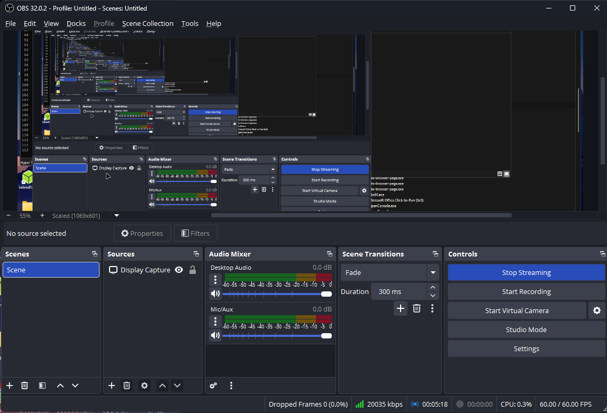
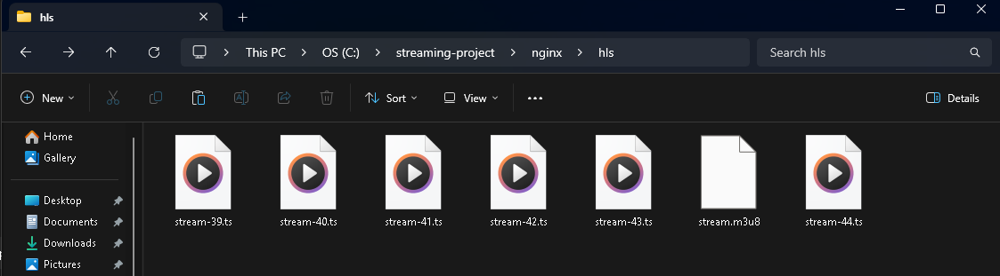
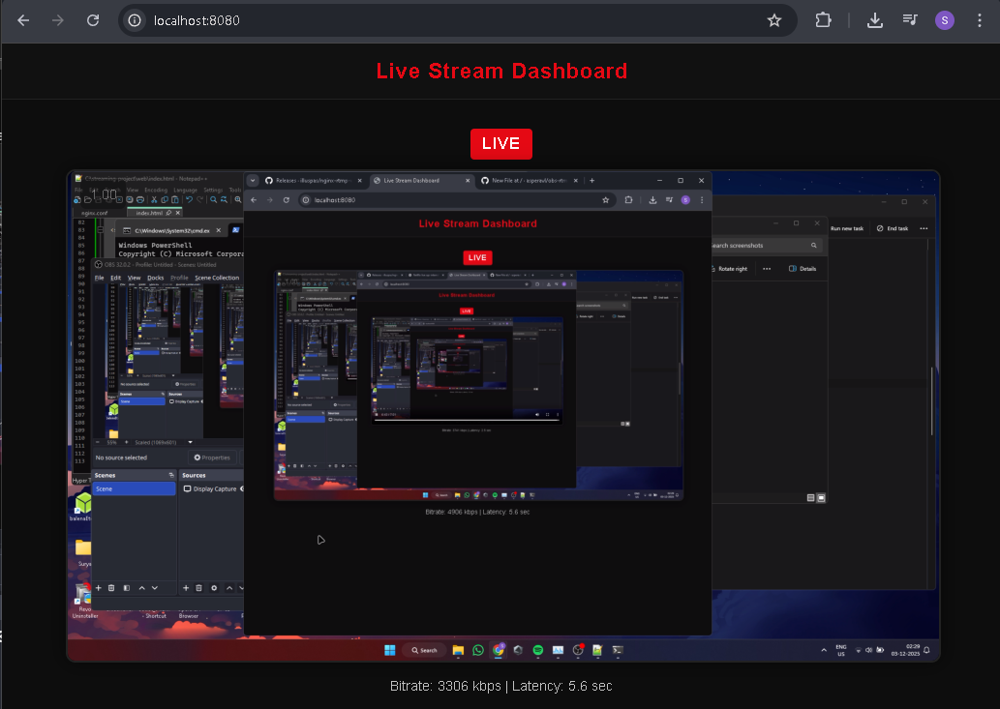

# End-to-End Live Streaming Pipeline (OBS → RTMP → HLS → Web Player)

This project implements a functional live streaming pipeline using OBS Studio for RTMP ingest, an NGINX server with the RTMP module for segmentation, and a custom web player using hls.js. It demonstrates how real-time streaming systems ingest, segment, and deliver live video.

---

## Features

- RTMP ingest via OBS  
- HLS output (.ts segments + .m3u8 playlist)  
- Web playback using Media Source Extensions and hls.js  
- Real-time behavior: segment rotation, playlist updates, and observable latency  

---

## Architecture Overview

    +-------------------+       RTMP        +-----------------------+       HLS        +---------------------+
    |       OBS         |  ----------→      |     NGINX RTMP        |  ----------→     |     Web Browser     |
    |  (Encoder/Input)  |                   | (Ingest + HLS Output) |                  |   (hls.js Player)   |
    +-------------------+                   +-----------------------+                  +---------------------+
                                                 |
                                                 | Generates
                                                 v
                                          +----------------+
                                          |  HLS Segments  |
                                          | (.ts, .m3u8)   |
                                          +----------------+

---

## Project Structure

    /
    ├─ nginx/
    │  ├─ nginx.exe
    │  ├─ conf/
    │  │  └─ nginx.conf
    │  └─ (runtime folders: hls/, logs/, temp/ — ignored)
    │
    ├─ web/
    │  └─ index.html
    │
    └─ assets/
        ├─ obs-streaming.png
        ├─ hls-folder.png
        ├─ web-player.png
        └─ architecture.png

---

## Setup Instructions

### 1. Install OBS Studio  
https://obsproject.com/

Configure:  
- Service: Custom  
- Server: rtmp://localhost/live  
- Stream Key: stream  

---

### 2. Install NGINX With RTMP Module  
Use an RTMP-enabled Windows build such as the one from illuspas/nginx-rtmp-win32.

---

### 3. Configure nginx.conf

    worker_processes 1;

    events {
        worker_connections 1024;
    }

    rtmp {
        server {
            listen 1935;
            chunk_size 4096;

            application live {
                live on;
                record off;

                hls on;
                hls_path hls;
                hls_fragment 2s;
                hls_playlist_length 6s;
            }
        }
    }

    http {
        include mime.types;
        default_type application/octet-stream;

        sendfile on;

        server {
            listen 8080;

            location / {
                alias ./web/;
                index index.html;
            }

            location /hls {
                alias ./nginx/hls/;
                add_header Cache-Control no-cache;
            }
        }
    }

---

### 4. Start and Stop NGINX

Start:

    nginx.exe

Stop:

    taskkill /IM nginx.exe /F

---

### 5. Start Streaming from OBS

NGINX generates files like:

    stream.m3u8
    segment1.ts
    segment2.ts
    ...

---

### 6. Open the Web Player

Go to:

    http://localhost:8080/

---

## Screenshots

OBS Streaming  

HLS Segment Folder  

Web Player  

---

## Observations

- Latency varies depending on fragment duration and OBS encoder settings  
- Keyframe interval = 2 seconds works best with HLS  
- CPU vs GPU encoding affects segment timing & stability  

---

## Known Limitations

- No adaptive bitrate (ABR)  
- No failover  
- Local-only delivery  
- Stats shown are placeholder values  

---

## Future Enhancements

- Real bitrate calculation  
- Glass-to-glass latency measurement  
- Adaptive bitrate streaming (HLS ladder)  
- Health monitoring dashboard  
- Failover ingest simulation  

---

## License  
MIT License.
